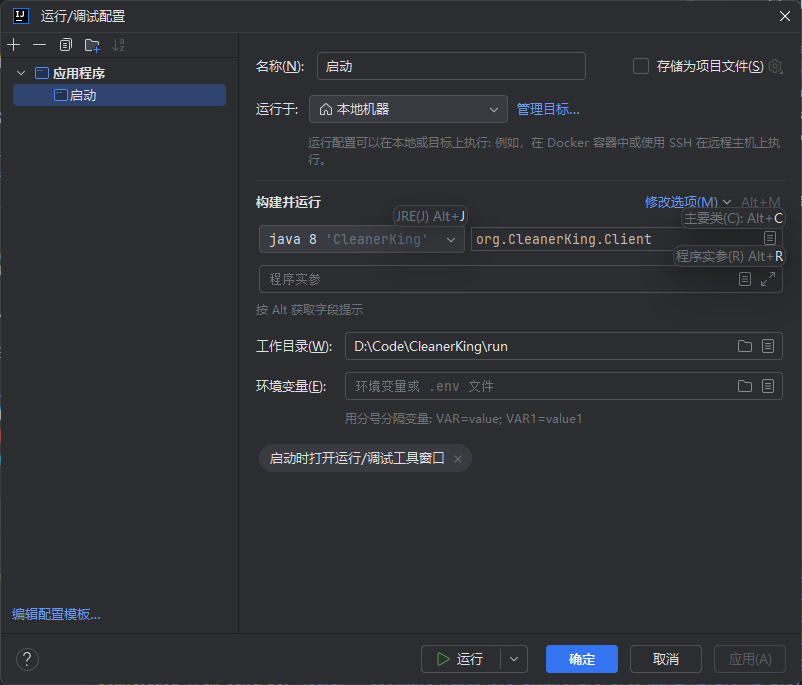

# 😈 CleanerKing - 全能电脑清理工具 😈

## 🚀 CleanerKing 的独特优势 🚀

**CleanerKing** 是一款由 **DWGX** 开发的全能电脑清理工具，基于 **Java** 语言编写。它专注于高效、实用的控制台操作，为追求快速、便捷和无冗余界面体验的高级用户量身打造。

---

## ⚡ 核心优势 ⚡

### 💻 高效便捷的控制台操作
- **极速响应**：无臃肿的图形界面，命令行操作，高效且不卡顿。
- **专业级工具**：为高级用户和开发者设计，简洁高效，精准控制。

### 🔥 强大的一键清理与高级清理功能
- **💥 一键清理**：快速清除临时文件、系统缓存、预取文件、回收站等。
- **🛠 高级清理**：按需选择清理对象，灵活控制清理范围。

### 🌐 超强文件搜索与删除功能
- **🔍 高级搜索**：支持按文件大小、日期、关键词、正则表达式进行过滤。
- **🚀 极速搜索**：独创搜索算法，大幅提升文件扫描和匹配速度。
- **🧹 智能清理**：自动识别并删除无用大文件，释放磁盘空间。

### ⚙️ Windows 系统工具整合
- **📂 内置工具菜单**：快速调用磁盘清理、碎片整理、系统信息等内置工具。
- **🛠 自动化操作**：整合多个 Windows 内置命令，提高工作效率。

### 🌟 个性化自定义功能
- **💄 3D ASCII 艺术标题**：自定义艺术标题颜色。
- **🌈 动态动画与进度条**：可自定义动画颜色。
- **🔧 高度可配置**：启用/禁用日志记录、动画效果等。

### 🚀 极致性能与稳定性
- **🐇 高性能 Java 代码**：多线程技术，提高清理和搜索速度。
- **🛡 稳定可靠**：严格测试，确保在各种系统环境下稳定运行。

---

## 🛠️ 使用场景

- **开发者与高级用户**：频繁清理临时文件、缓存和日志。
- **系统维护人员**：高效管理和清理系统垃圾。
- **电脑重度用户**：定期清理大文件和无用数据。

---

## 🛠️ 安装与使用

1. 从本项目源码采集仓库中下载。
2. 编译项目：
   ```bash
   javac -encoding UTF-8 src/org/CleanerKing/Client.java
   ```
3. 运行清理工具：
   ```bash
   java -Dfile.encoding=UTF-8 org.CleanerKing.Client
   ```

4. 使用批处理文件（BAT）启动：
   ```bat
   @echo off
   chcp 65001 > nul

   net session >nul 2>&1
   if %errorlevel% neq 0 (
   echo 正在以管理员身份重新启动...
   powershell -Command "Start-Process '%~0' -Verb RunAs"
   exit /b
   )
   
   if not exist "%~dp0CleanerKing.jar" (
   echo 错误: 未找到 CleanerKing.jar，请确保它与本脚本位于同一目录。
   pause
   exit /b
   )

   java -Dfile.encoding=UTF-8 -jar "%~dp0CleanerKing.jar"
   echo.
   echo 清理工具已运行完成，感谢使用！
   pause
   ```

5. 此外您可以这么设置启动参数


---

## 📈 更新迭代与持续优化

- **不断完善功能**：根据用户反馈持续优化和修复漏洞。
- **用户驱动**：欢迎用户提供建议，共同打造更强大的清理工具。

---

## 🎉 为什么选择 CleanerKing？

- 🏃 **高效便捷**：一键操作，极速响应。
- 🛠 **功能全面**：清理、搜索、系统工具一体化。
- 🎨 **个性化设置**：丰富自定义选项。
- 🧠 **智能清理**：自动识别无用数据。
- 💪 **稳定可靠**：强大的 Java 后端保障性能。

**CleanerKing** 是你提升电脑性能、保持系统清洁的最佳伴侣！ 😈💻

---

## 📧 联系方式

如有问题或建议，请联系：**dwgx1337@gmail.com**

🚀 **欢迎加入我们，共同打造最强的电脑清理工具！** 🎉
